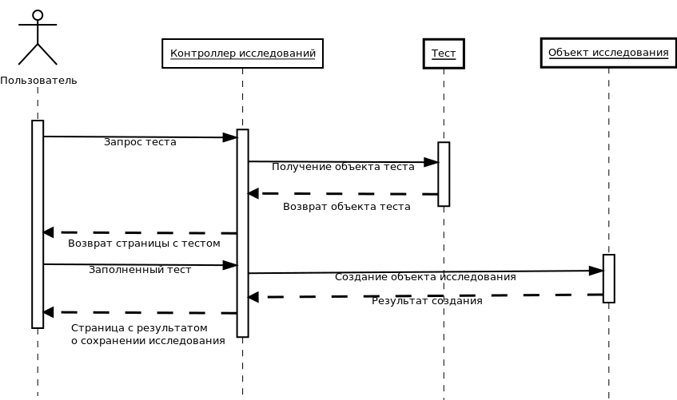

# rVisor - система юзабилити-тестирования

Данный проект написан на языке Ruby с использованием Ruby on Rails.

## Структура проекта

### Use case диаграмма

### Диаграмма классов

### Диаграмма последовательности

